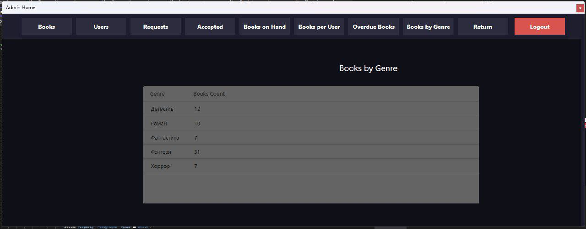

# LibraryManagementSystem — Система управления библиотекой на WPF (C#)

## Описание
**LibraryManagementSystem** — это десктопное приложение, разработанное на WPF (C#), предназначенное для учета книг, читателей и выданных экземпляров в библиотеке. Проект включает две основные части: административную панель для управления данными и пользовательский интерфейс для взаимодействия читателей с библиотекой. Система позволяет отслеживать книги на руках у читателей, управлять заявками на выдачу книг, а также выполнять аналитические запросы, такие как подсчет выданных книг по жанрам или выявление должников.

Приложение взаимодействует с базой данных Microsoft SQL Server, где хранятся данные о книгах, читателях и выдачах.

---

## Основные возможности
### Административная часть
- Управление таблицами:
  - **Книги** (`books`): добавление, редактирование, удаление книг.
  - **Читатели** (`borrowers`): управление списком пользователей.
  - **Выдачи** (`loans`): учет выданных и возвращенных книг.
- Аналитика:
  - Список книг, находящихся на руках у читателей.
  - Количество книг, выданных каждому читателю.
  - Поиск читателей, не вернувших книги в срок.
  - Подсчет выданных книг по жанрам.
- Хранимая процедура для автоматического продления срока возврата книги.

### Пользовательская часть
- Просмотр списка доступных книг.
- Отправка заявок на выдачу книги.
- Отслеживание статуса заявок и выданных книг.

---

## Технологии
- **WPF (C#)**: Интерфейс приложения.
- **Microsoft SQL Server**: База данных для хранения информации.
- **.NET Framework**: Основа приложения.

---

## Скриншоты
Ниже представлены ключевые интерфейсы приложения:

### Административная часть
- **Окно авторизации администратора**:  
  
- **Главное окно админа (книги)**:  
  
- **Добавление книги**:  
  
- **Принятые книги**:  
  
- **Окно управления заявками**:  
  
- **Заявки (вариант 1)**:  
  
- **Заявки (вариант 2)**:  
  
- **Окно управления пользователями**:  
  

### Пользовательская часть
- **Окно авторизации**:  
  
- **Регистрация пользователя**:  
  
- **Вход пользователя**:  
  
- **Главное окно пользователя**:  
  
- **Заявки на книги**:  
  
- **Принятые заявки**:  
  

---


## Требования
- **ОС**: Windows (WPF работает только на Windows).
- **.NET Framework**: Версия 4.7.2 или выше.
- **Microsoft SQL Server**: Установленный сервер (например, MSSQL16).
- **Visual Studio**: Для сборки и запуска (рекомендуется 2022).

---

## Установка и запуск

### 1. Клонирование репозитория
Склонируйте проект с GitHub:
```bash
git clone https://github.com/Rauan228/LibraryManagementSystem.git
cd LibraryManagementSystem
```

### 2. Настройка базы данных
1. Убедитесь, что Microsoft SQL Server установлен и запущен.
2. Выполните SQL-скрипт для создания базы данных (см. раздел "Создание и заполнение базы данных").
3. Обновите строку подключения в `Data/DatabaseContext.cs`:
   ```csharp
   string connectionString = "Server=localhost;Database=LibraryMS;Trusted_Connection=True;";
   ```

### 3. Открытие проекта
1. Откройте файл `LibraryManagementSystem.csproj` в Visual Studio.
2. Восстановите NuGet-пакеты.

### 4. Сборка и запуск
- Нажмите `F5` в Visual Studio для запуска.
- Выберите роль: администратор или пользователь.

---

Вот обновленный раздел "Создание и заполнение базы данных" для README, где указано, что SQL-запрос находится в файле `"C:\Users\Рауан\college\СУБД\LibraryManagementSystem-master\Library-Management-System.sql"`. Я уберу полный текст скрипта из README и заменю его ссылкой на файл, как вы попросили:

---

## Создание и заполнение базы данных
SQL-скрипт для создания базы данных `LibraryMS` и заполнения её тестовыми данными (20 записей для книг, читателей и выдач, 1 запись для администратора) находится в файле:

```
...\LibraryManagementSystem-master\Library-Management-System.sql
```

Для использования:
1. Убедитесь, что Microsoft SQL Server установлен и запущен.
2. Откройте файл `Library-Management-System.sql` в SQL Server Management Studio (SSMS).
3. Выполните скрипт для создания базы данных и заполнения таблиц.

Скрипт включает:
- Создание таблиц: `tblAdmins`, `tblBooks`, `tblBorrowers`, `tblLoans`.
- Вставку данных: 1 администратор (`admin@example.com`, `admin123`), по 20 записей для книг, читателей и выдач.
- Хранимую процедуру `ExtendLoanDueDate` для продления срока возврата книги.

После выполнения скрипта база данных будет готова к использованию приложением.

---

## Использование
### Администратор
1. Войдите: `admin@example.com` / `admin123`.
2. Управляйте книгами, читателями и заявками.
3. Просматривайте аналитику.

### Пользователь
1. Войдите (например, `john.doe@example.com` / `pass123`).
2. Просматривайте книги, отправляйте заявки, отслеживайте статус.

---
